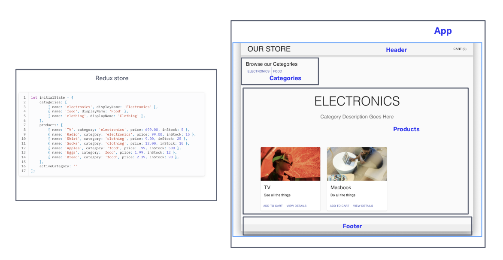

# Store Front

Creating an e-Commerce storefront using React with Redux, coupled with your live API server. Below is an overview of the project's evolution through its different phases

### Author: Tricia Sawyer

### Problem Domain

#### Phase 1 - Setting the Foundation

In the first phase, my goal was to set up the basic scaffolding of the application with initial styling and basic behaviors. This initial build established the file structure and state management, laying the groundwork for future development.

**User Stories:**
- See a list of available product categories.
- Choose a category and see a list of all available products matching that category.
- Enjoy a clean, easy-to-use user interface for confident online shopping.

#### Phase 2 - Adding the Cart

Phase 2 introduces the "Add to Cart" feature, allowing users to select products and persist them in their shopping cart for later purchase.

**Additional User Stories:**
- Add products to the shopping cart.
- View products in the shopping cart.
- Change the quantity of items in the cart.
- Remove items from the shopping cart.

#### Phase 3 - Connecting to Live Inventory

In Phase 3, I connected our Virtual Store to a live API, making the data persistent and separately manageable.

**Additional User Stories:**
- Interact with live inventory.
- Ensure that when adding an item to the cart, it's removed from inventory to prevent others from purchasing it.

#### Phase 4 - Completing the Virtual Store

Phase 4 added two full page views to the application: Product Details and Checkout.

**Additional User Stories:**
- View a detailed product description.
- Initiate the checkout process to purchase items and have them delivered.

### Deployment

[CodeSandbox](https://6k3j56-5173.csb.app/)

### Links and Resources

[Vite](https://vitejs.dev/guide/)

[Git issues solution](https://www.youtube.com/watch?v=yo2bMGnIKE8)

[Randomized images](https://awik.io/generate-random-images-unsplash-without-using-api/)

[Testing with vite](https://zaferayan.medium.com/how-to-setup-jest-and-react-testing-library-in-vite-project-2600f2d04bdd)

[Redux toolkit](https://redux-toolkit.js.org/api/configureStore)

[API products](https://api-js401.herokuapp.com/api/v1/products)

[API categories](https://api-js401.herokuapp.com/api/v1/categories)

### Collaborators

- Ryan Gallaway
- Stephen Clemmer heped me with fixing the categories button display
- ChatGPT to help write tests
- Daniel Frey helped review code and debug

### UML

### Set up

To set up this project, follow these steps:

- Run `npm create vite@latest`

Follow the given steps

- Run `npm run dev`

- Install dependencies using `npm i redux react-redux @redux-devtools/extension`

- Install Redux Toolkit with `npm i @reduxjs/toolkit`
